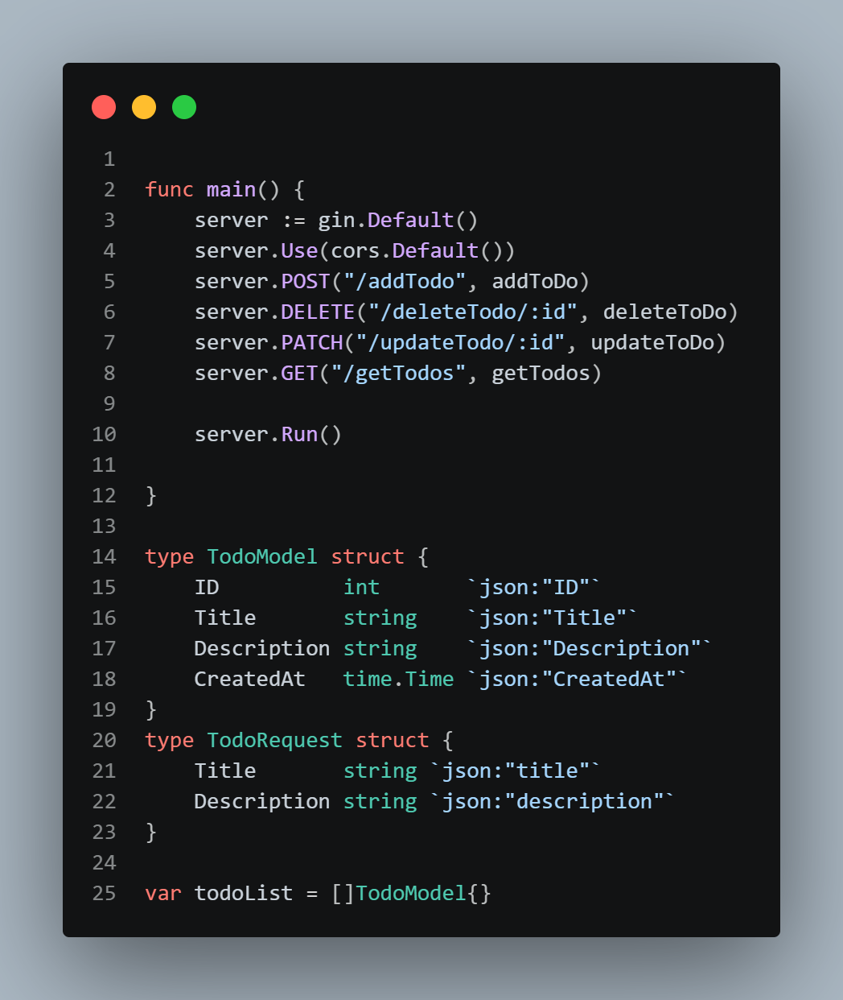
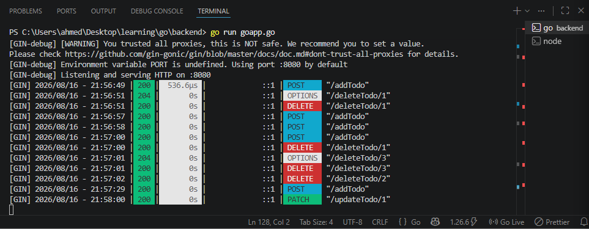
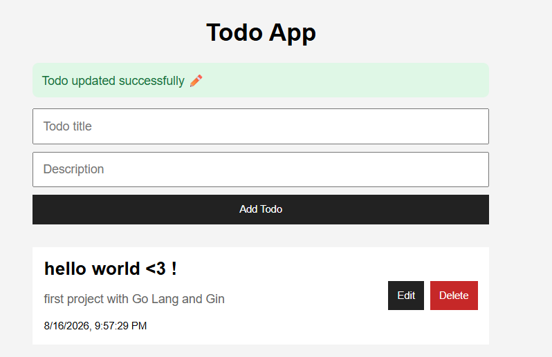

# Go + React Todo App 🚀

A small full-stack Todo application built with **Go, Gin, and React**.

I previously built a similar Todo app using Flutter, but decided to rebuild it with Go and Gin to practice **backend development and REST APIs**.

## Features

- Create Todo
- Get Todos
- Update Todo
- Delete Todo
- React frontend connected to Go backend
- JSON API
- CORS

## Tech Stack

- Go
- Gin
- React
- JavaScript
- REST API
- JSON

## API Endpoints

| Method | Endpoint          | Description |
| ------ | ----------------- | ----------- |
| POST   | `/addTodo`        | Create Todo |
| GET    | `/getTodos`       | Get Todos   |
| PATCH  | `/updateTodo/:id` | Update Todo |
| DELETE | `/deleteTodo/:id` | Delete Todo |

## Run Locally

### Backend

```bash
cd backend
go mod tidy
go run goapp.go
```

Backend runs on:

http://localhost:8080

### Frontend

```bash
npm install
npm run dev
```

Frontend runs on:

http://localhost:5173


## Screenshots

**Server initialization**


**Server running / handling a request**


**Todo List UI**


## Goal

The main goal of this project was learning by building and getting more comfortable with Go backend development.
